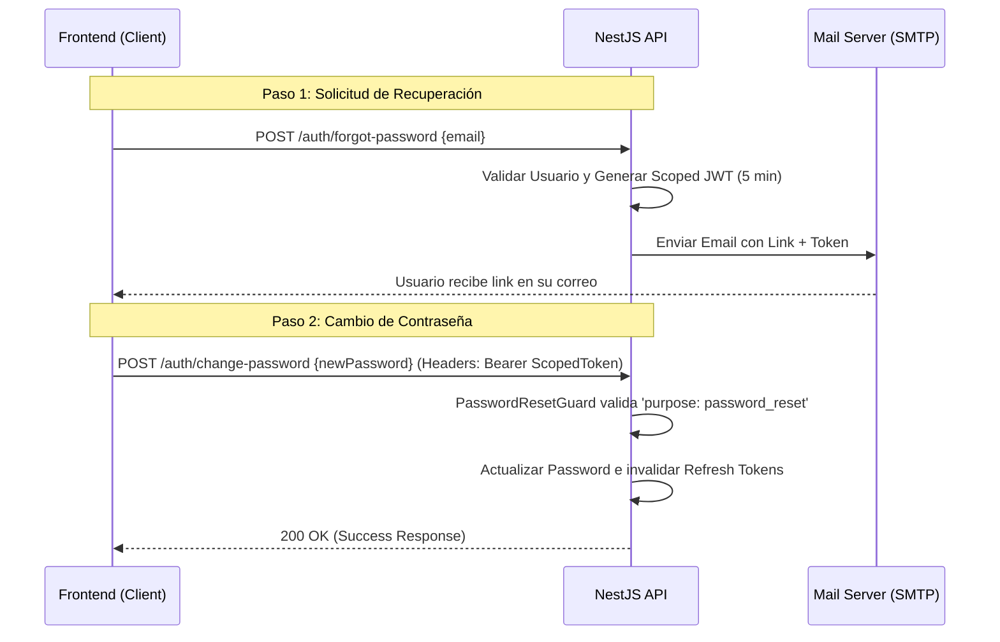

### Flujo de Recuperación (Sequence Diagram)

```mermaid
sequenceDiagram
    participant Front as Frontend (Client)
    participant API as NestJS API
    participant Mail as Mail Server (SMTP)

    Note over Front, API: Paso 1: Solicitud de Recuperación
    Front->>API: POST /auth/forgot-password {email}
    API->>API: Validar Usuario y Generar Scoped JWT (5 min)
    API->>Mail: Enviar Email con Link + Token
    Mail-->>Front: Usuario recibe link en su correo

    Note over Front, API: Paso 2: Cambio de Contraseña
    Front->>API: POST /auth/change-password {newPassword} (Headers: Bearer ScopedToken)
    API->>API: PasswordResetGuard valida 'purpose: password_reset'
    API->>API: Actualizar Password e invalidar Refresh Tokens
    API-->>Front: 200 OK (Success Response)
```
