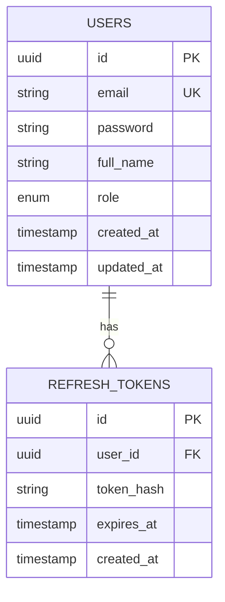

### Modelo de Datos (ERD)

```mermaid
erDiagram
    USERS {
        uuid id PK
        string email UK
        string password
        string full_name
        enum role
        timestamp created_at
        timestamp updated_at
    }
    REFRESH_TOKENS {
        uuid id PK
        uuid user_id FK
        string token_hash
        timestamp expires_at
        timestamp created_at
    }
    USERS ||--o{ REFRESH_TOKENS : has
```
