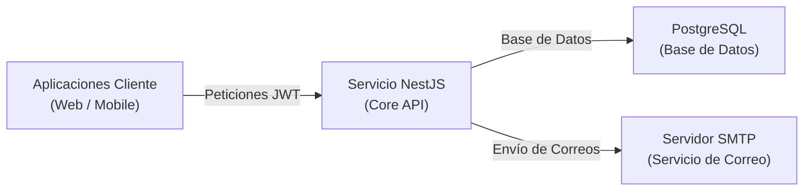

### Integración del Sistema

```mermaid
flowchart LR
    Client["Aplicaciones Cliente<br/>(Web / Mobile)"] -- "Peticiones JWT" --> NestJS["Servicio NestJS<br/>(Core API)"]
    
    DB["PostgreSQL\n(Base de Datos)"]
    SMTP["Servidor SMTP\n(Servicio de Correo)"]

    NestJS -- "Base de Datos" --> DB
    NestJS -- "Envío de Correos" --> SMTP
```
