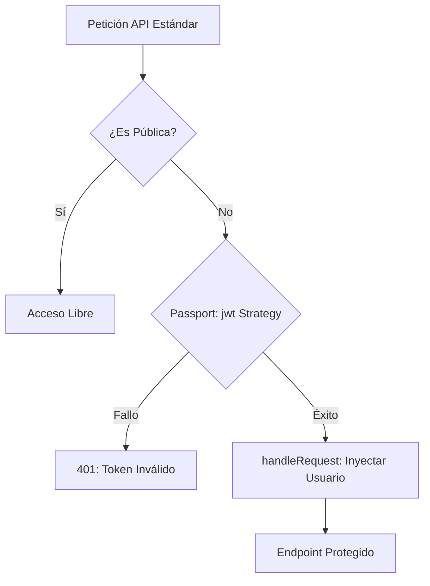

### JwtAuthGuard (Identidad)

```mermaid
flowchart TD
    A[Petición API Estándar] --> B{¿Es Pública?}
    B -- Sí --> C[Acceso Libre]
    B -- No --> D{Passport: jwt Strategy}
    D -- Fallo --> E["401: Token Inválido"]
    D -- Éxito --> F[handleRequest: Inyectar Usuario]
    F --> G[Endpoint Protegido]
```
