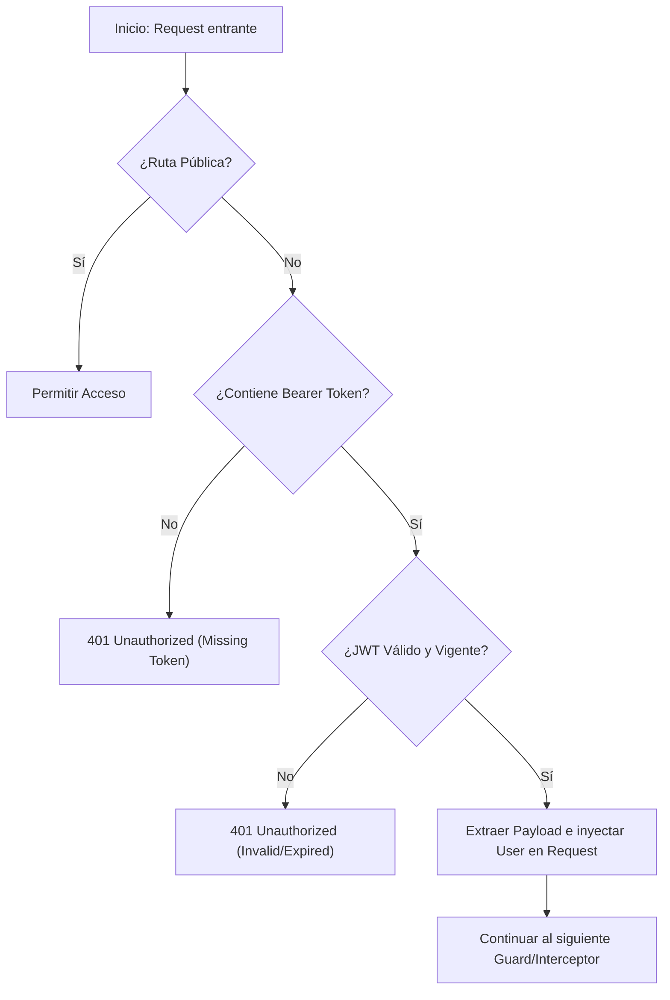

### JwtAuthGuard (Identidad)

```mermaid
graph TD
    A[Inicio: Request entrante] --> B{¿Ruta Pública?}
    B -- Sí --> C[Permitir Acceso]
    B -- No --> D{¿Contiene Bearer Token?}
    D -- No --> E["401 Unauthorized (Missing Token)"]
    D -- Sí --> F{¿JWT Válido y Vigente?}
    F -- No --> G["401 Unauthorized (Invalid/Expired)"]
    F -- Sí --> H[Extraer Payload e inyectar User en Request]
    H --> I[Continuar al siguiente Guard/Interceptor]
```
