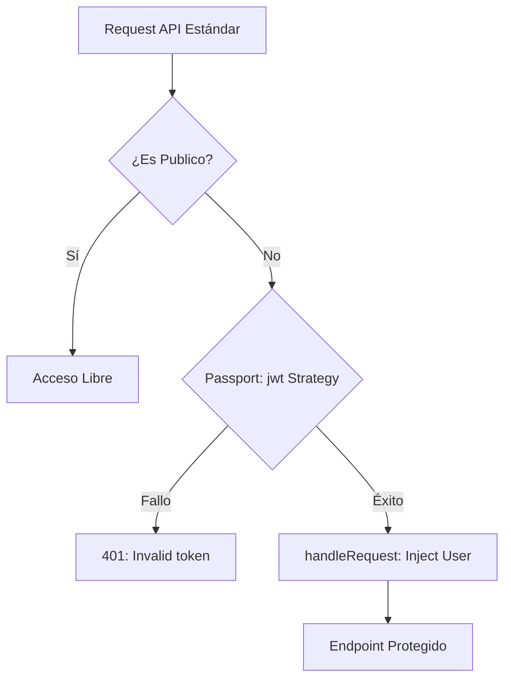

### JwtAuthGuard (Identidad)

```mermaid
flowchart TD
    A[Request API Estándar] --> B{¿Es Publico?}
    B -- Sí --> C[Acceso Libre]
    B -- No --> D{Passport: jwt Strategy}
    D -- Fallo --> E[401: Invalid token]
    D -- Éxito --> F[handleRequest: Inject User]
    F --> G[Endpoint Protegido]
```
