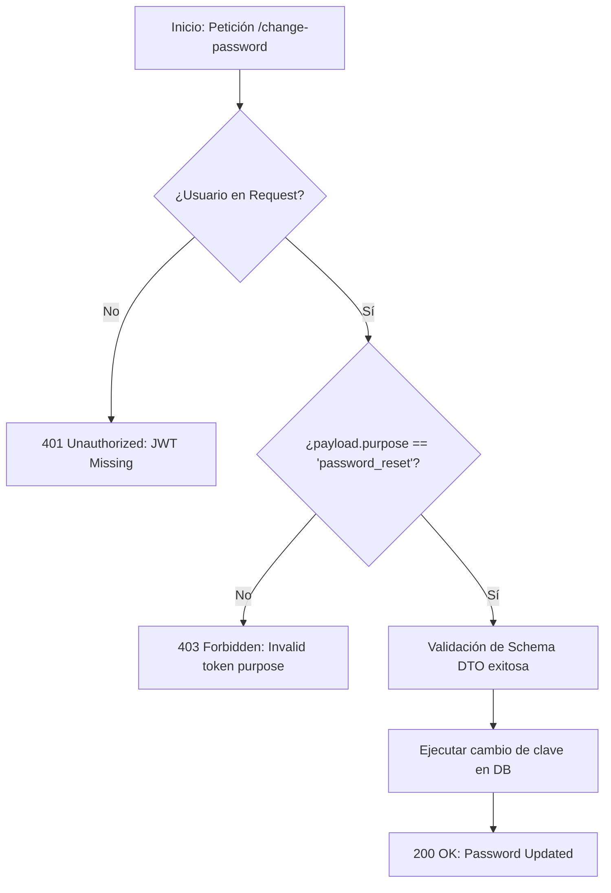

### PasswordResetGuard (Recuperación Stateless)

```mermaid
flowchart TD
    A[Inicio: Petición /change-password] --> B{¿Usuario en Request?}
    B -- No --> C[401 Unauthorized: JWT Missing]
    B -- Sí --> D{"¿payload.purpose == 'password_reset'?"}
    D -- No --> E["403 Forbidden: Invalid token purpose"]
    D -- Sí --> F[Validación de Schema DTO exitosa]
    F --> G[Ejecutar cambio de clave en DB]
    G --> H[200 OK: Password Updated]
```
