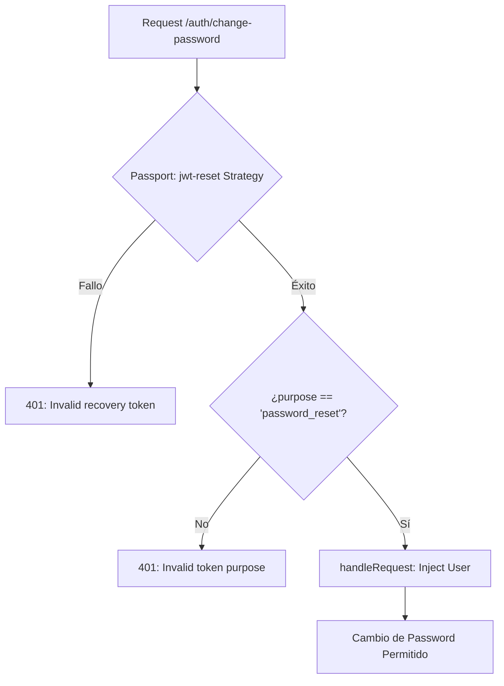

### PasswordResetGuard (Recuperación Stateless)

```mermaid
flowchart TD
    A[Request /auth/change-password] --> B{Passport: jwt-reset Strategy}
    B -- Fallo --> C[401: Invalid recovery token]
    B -- Éxito --> D{¿purpose == 'password_reset'?}
    D -- No --> E[401: Invalid token purpose]
    D -- Sí --> F[handleRequest: Inject User]
    F --> G[Cambio de Password Permitido]
```
