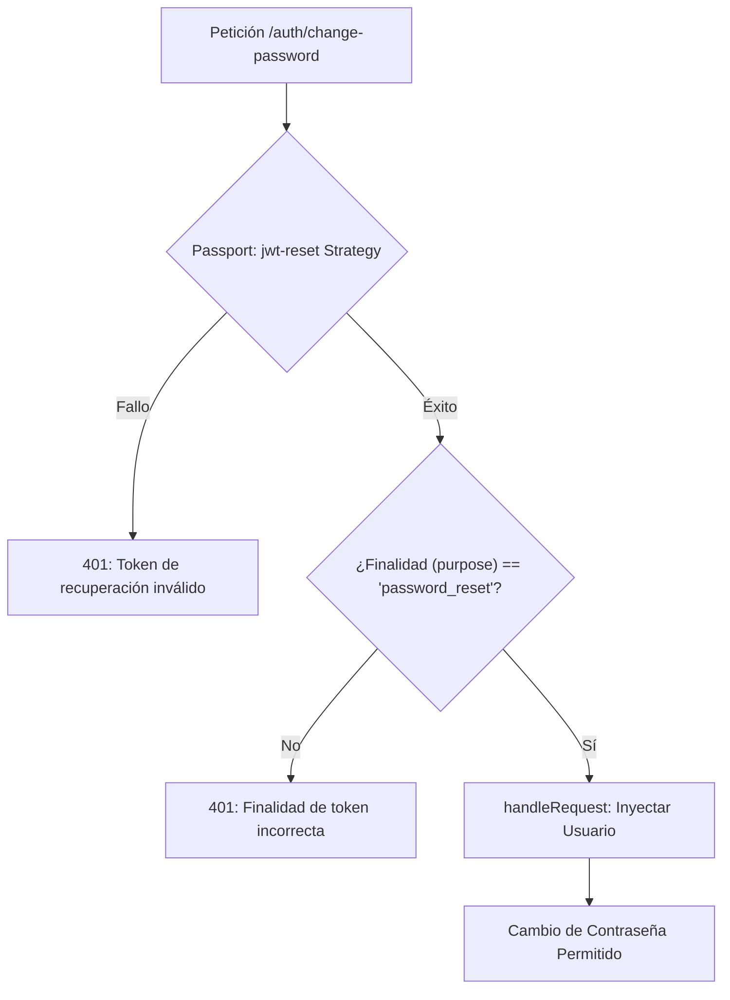

### PasswordResetGuard (Recuperación Stateless)

```mermaid
flowchart TD
    A[Petición /auth/change-password] --> B{Passport: jwt-reset Strategy}
    B -- Fallo --> C["401: Token de recuperación inválido"]
    B -- Éxito --> D{"¿Finalidad (purpose) == 'password_reset'?"}
    D -- No --> E["401: Finalidad de token incorrecta"]
    D -- Sí --> F[handleRequest: Inyectar Usuario]
    F --> G[Cambio de Contraseña Permitido]
```
