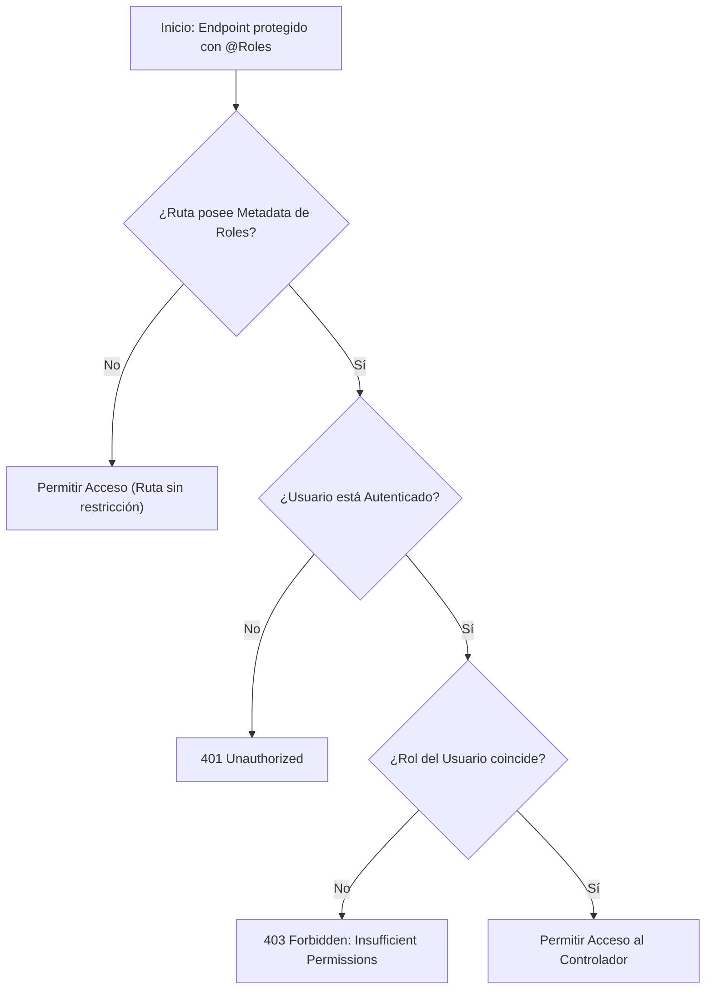

### RolesGuard (Autorización RBAC)

```mermaid
flowchart TD
    A[Inicio: Endpoint protegido con @Roles] --> B{¿Ruta posee Metadata de Roles?}
    B -- No --> C["Permitir Acceso (Ruta sin restricción)"]
    B -- Sí --> D{¿Usuario está Autenticado?}
    D -- No --> E["401 Unauthorized"]
    D -- Sí --> F{¿Rol del Usuario coincide?}
    F -- No --> G["403 Forbidden: Insufficient Permissions"]
    F -- Sí --> H[Permitir Acceso al Controlador]
```
